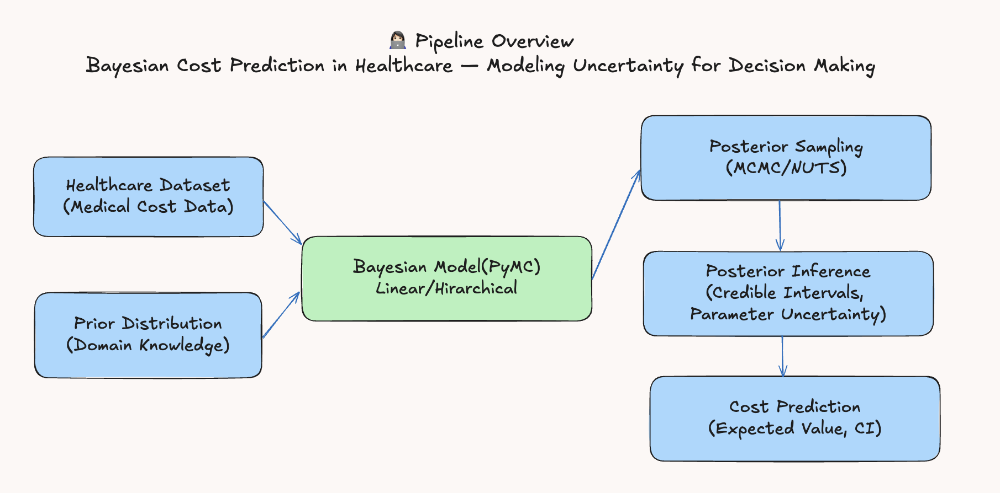
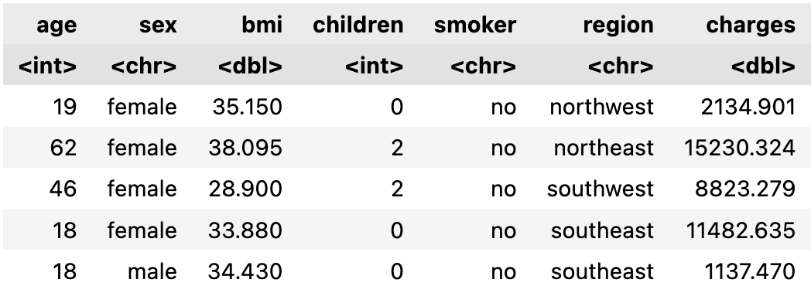
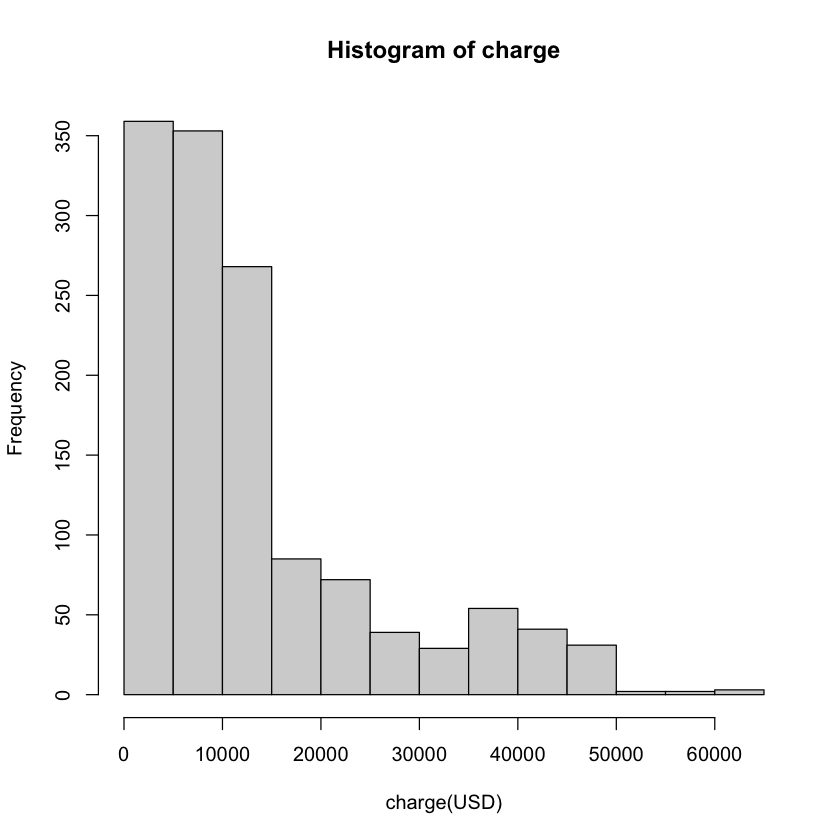
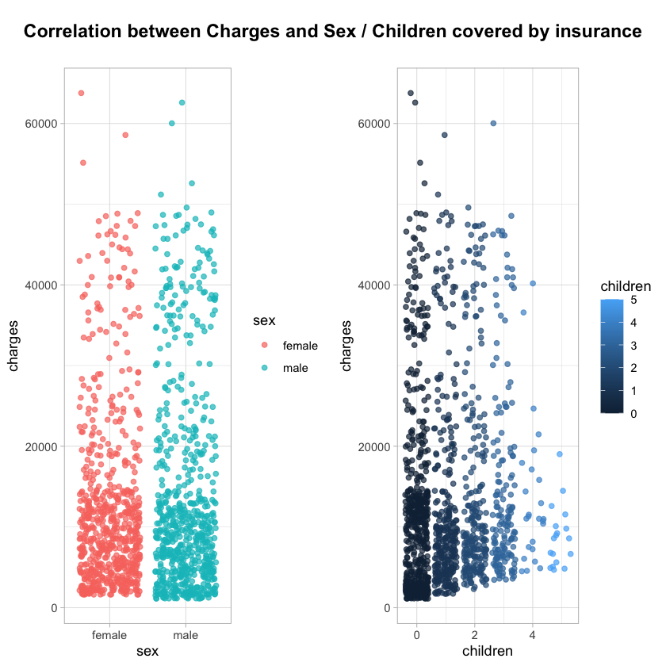
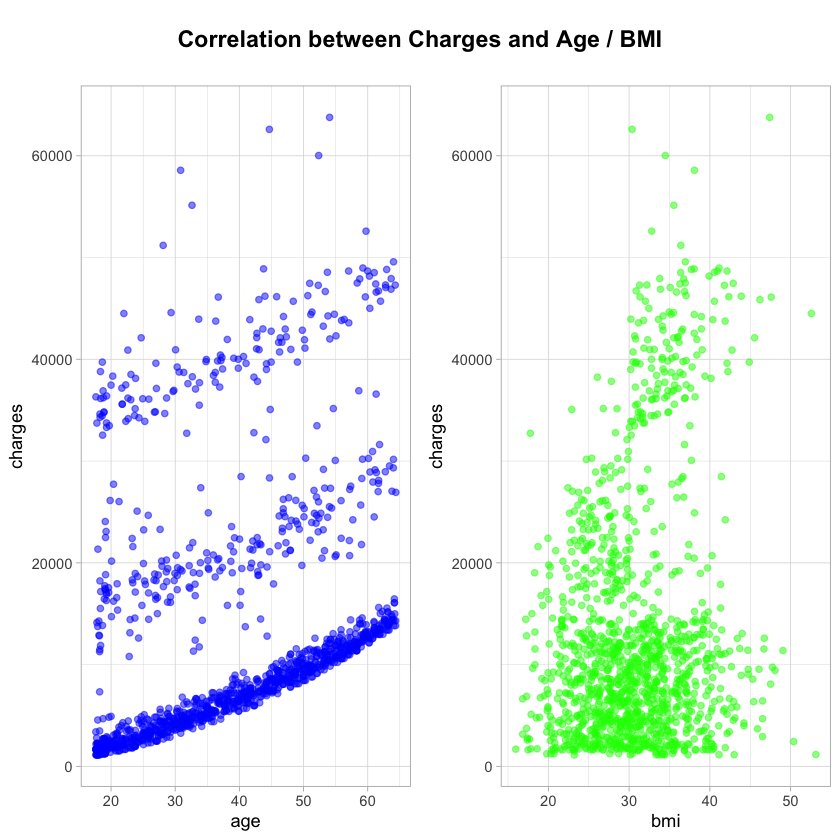
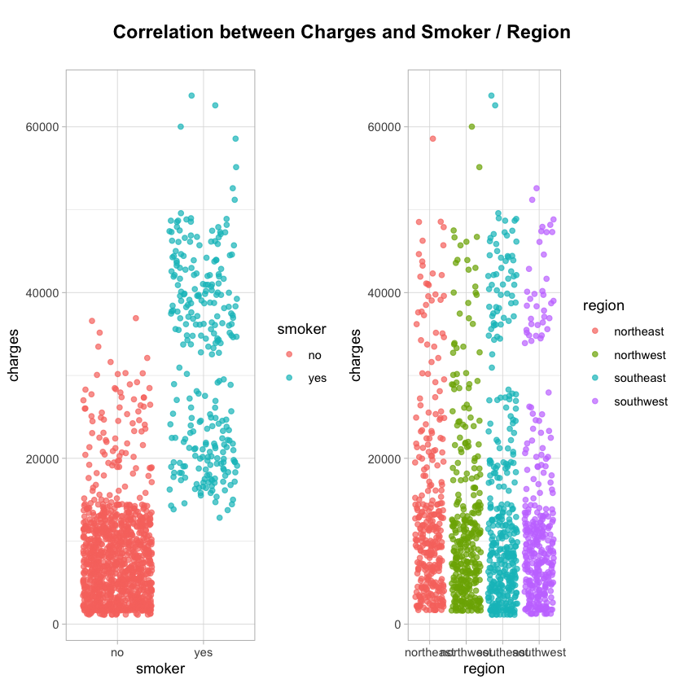
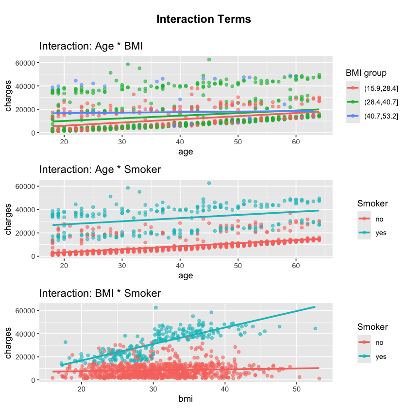
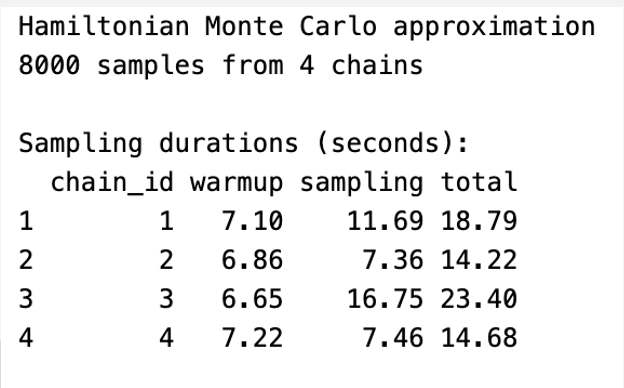
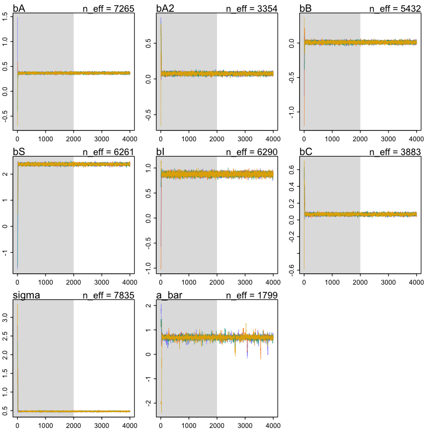
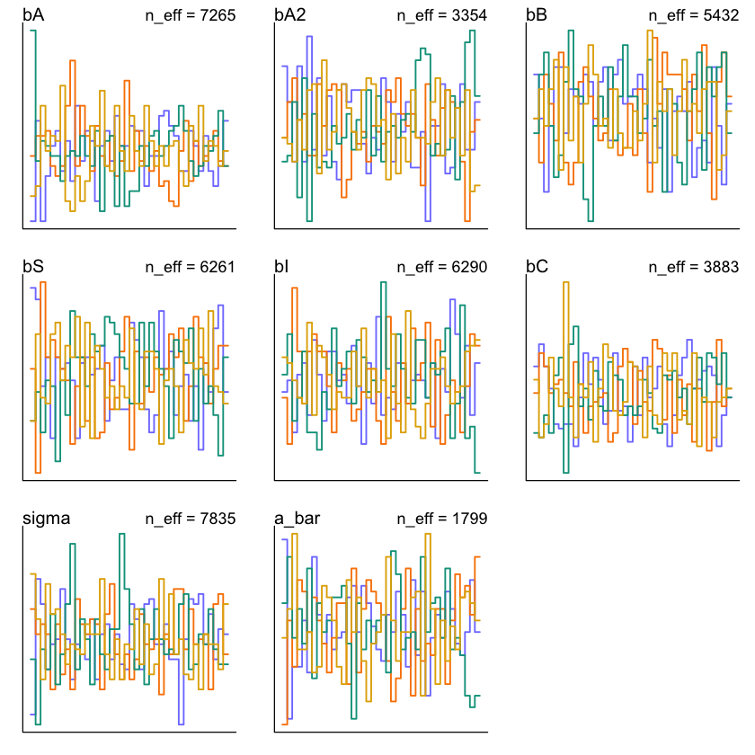

# 🩺 Bayesian vs Frequentist Healthcare Cost Prediction

A comprehensive comparative study of **Bayesian Linear Regression** and traditional **Frequentist Linear Regression** for predicting individual healthcare costs using the Medical Cost Personal Dataset.

## 📋 Project Overview

This project implements and compares two statistical approaches for healthcare cost prediction:

<div align="center">

| Approach | Method | Key Features |
|:---:|:---:|:---:|
| **🔬 Frequentist** | Maximum Likelihood Estimation | Point estimates, p-values, confidence intervals |
| **🎯 Bayesian** | Hamiltonian Monte Carlo (HMC) | Posterior distributions, credible intervals, uncertainty |

</div>

### 🎯 Research Objectives
- **Compare predictive performance** between frequentist and Bayesian approaches
- **Evaluate uncertainty quantification** capabilities
- **Assess model interpretability** and diagnostic tools
- **Analyze interaction effects** and nonlinear relationships
- **Provide practical insights** for healthcare cost prediction

### 📊 Dataset Information
- **Source**: Medical Cost Personal Dataset
- **Sample Size**: 1,338 observations
- **Features**: Age, Sex, BMI, Children, Smoker, Region, Charges
- **Target**: Healthcare charges (continuous variable)

### 🔄 Analysis Pipeline Overview
<div align="center">



*Complete workflow from data exploration to model comparison*

</div>

## 🔍 Key Features

### Bayesian Analysis
- Full Bayesian workflow using `quap()` and `ulam()` with HMC sampling
- Posterior visualization, traceplots, rank plots, and convergence diagnostics
- Hierarchical model structure with group-level intercepts for region
- Interaction term analysis (e.g., `BMI × Smoker`) and nonlinear effects (e.g., `Age²`)
- Uncertainty quantification and credible intervals

### Model Comparison
- Performance metrics: RMSE, MAE, R², and WAIC
- Cross-validation and model diagnostics
- Statistical significance testing
- Residual analysis and model assumptions

## 📊 Key Results

### 🏆 Performance Comparison
<div align="center">

| Model | RMSE | MAE | R² | WAIC |
|:---:|:---:|:---:|:---:|:---:|
| **Frequentist Linear Regression** | 4930.55 | 2952.02 | 0.8409 | N/A |
| **Bayesian Linear Regression** | **4796.80** | **2888.05** | **0.8430** | **1857.32** |

</div>

### 📈 Key Findings
<div align="center">

| Metric | Improvement | Significance |
|:---:|:---:|:---:|
| **RMSE** | **2.7%** ⬇️ | Better prediction accuracy |
| **MAE** | **1.6%** ⬇️ | Lower average error |
| **R²** | **+0.0021** ⬆️ | Better model fit |
| **WAIC** | **1857.32** | Model comparison metric |

</div>

### 🎯 Statistical Insights
- ✅ **Bayesian model outperformed frequentist approach** across all metrics
- ✅ **Uncertainty quantification** provides credible intervals for predictions
- ✅ **Posterior distributions** offer rich interpretability
- ✅ **HMC sampling** ensures robust parameter estimation
- ✅ **Both models achieved excellent performance** with R² > 0.84

## 📁 Project Structure

```
├── data/
│   └── insurance.csv                    # Medical Cost Personal Dataset (1,338 observations)
├── notebooks/
│   └── Health Care Cost Prediction Frequentist vs bayesian method.ipynb
│       ├── Data exploration and preprocessing
│       ├── Frequentist linear regression implementation
│       ├── Bayesian linear regression with HMC sampling
│       ├── Model comparison and evaluation
│       └── Visualization and interpretation
├── results/
│   ├── 📊 Visualizations/
│   │   ├── charge.png                   # Charge distribution visualization
│   │   ├── cor1.png, cor2.png, cor3.png # Correlation analysis plots
│   │   ├── dataset.png                  # Dataset overview and summary
│   │   ├── Frequentist vs bayesian.png  # Model comparison visualization
│   │   ├── interaction.png              # Interaction effects analysis
│   │   ├── posterior distribution.png   # Posterior distributions
│   │   ├── posterior summary.png        # Posterior summary statistics
│   │   ├── result-HMC.png               # HMC sampling results
│   │   ├── traceplot.png                # MCMC trace plots
│   │   └── trankplot.png                # Rank plots for diagnostics
│   ├── 📄 Reports/
│   │   ├── bayesian Final presentation_yejin.pdf
│   │   ├── Bayesian Final report_yejin hwang.pdf
│   │   ├── Healthcare_Cost_Prediction_Comparative_Study_yejin.pdf
│   │   └── pairs_plot.pdf               # Pairwise relationship plots
│   └── 📋 Documentation/
│       ├── Bayesian final project format.docx
│       ├── Bayesian Final report_yejin hwang.docx
│       ├── Bayesian Proposal of Final Project_yejin.docx
│       ├── COSC 6338_Final report_group4.docx
│       └── bayesian Final presentation_yejin.pptx
└── README.md
```

## 🚀 Getting Started

### Prerequisites

- R (version 4.0 or higher)
- Required R packages:
  - `rethinking` (for Bayesian analysis)
  - `ggplot2` (for visualization)
  - `dplyr` (for data manipulation)
  - `Hmisc` (for statistical functions)
  - `cowplot` (for plot arrangement)
  - `WVPlots` (for additional visualizations)

### Installation

1. Clone the repository:
```bash
git clone https://github.com/Yejin-Hwang/Bayesian-Cost-Prediction-in-Healthcare.git
cd Bayesian-Cost-Prediction-in-Healthcare
```

2. Install required R packages:
```r
install.packages(c("ggplot2", "dplyr", "Hmisc", "cowplot", "WVPlots"))
# Install rethinking package
install.packages("rethinking")
```

3. Run the analysis:
```bash
# Open the Jupyter notebook
jupyter notebook notebooks/Health\ Care\ Cost\ Prediction\ Frequentist\ vs\ bayesian\ method.ipynb
```

## 📈 Methodology

### Data Preprocessing
- Exploratory data analysis and visualization
- Feature engineering and transformation
- Missing value handling
- Outlier detection and treatment

### Model Development
1. **Frequentist Approach**:
   - Linear regression with maximum likelihood estimation
   - Model selection using AIC/BIC
   - Cross-validation for performance evaluation

2. **Bayesian Approach**:
   - Prior specification and justification
   - HMC sampling with `ulam()` function
   - Convergence diagnostics (trace plots, rank plots)
   - Posterior predictive checks

### Evaluation Metrics
- **RMSE**: Root Mean Square Error
- **MAE**: Mean Absolute Error
- **R²**: Coefficient of determination
- **WAIC**: Widely Applicable Information Criterion (Bayesian)

## 📊 Visualizations & Results

### 🔍 Data Exploration
<div align="center">

| Dataset Overview | Charge Distribution |
|:---:|:---:|
|  |  |
| *Medical Cost Dataset Summary* | *Healthcare Charges Distribution* |

</div>

### 📈 Correlation Analysis
<div align="center">

| Correlation Matrix 1 | Correlation Matrix 2 | Correlation Matrix 3 |
|:---:|:---:|:---:|
|  |  |  |
| *Variable Relationships* | *Detailed Correlations* | *Pattern Analysis* |

</div>

### ⚖️ Model Comparison
<div align="center">

| Frequentist vs Bayesian | Interaction Effects |
|:---:|:---:|
|  |  |
| *Performance Comparison* | *BMI × Smoker Interactions* |

</div>

### 🎯 Bayesian Analysis Results

#### Posterior Distributions & Summary Statistics
<div align="center">

| Posterior Distributions | Posterior Summary |
|:---:|:---:|
|  |  |
| *Parameter Distributions* | *Summary Statistics* |

</div>

**Posterior Distributions**: Shows the probability distributions of model parameters (intercepts, slopes) after incorporating both prior knowledge and observed data. Each parameter's uncertainty is quantified through these distributions.

**Posterior Summary**: Provides key statistics including mean, standard deviation, and credible intervals for each parameter, enabling robust uncertainty quantification.

#### HMC Sampling & Convergence Diagnostics
<div align="center">

| HMC Sampling Results | MCMC Diagnostics |
|:---:|:---:|
|  |  |
| *Hamiltonian Monte Carlo* | *Convergence Diagnostics* |

</div>

**HMC Sampling Results**: Displays the Hamiltonian Monte Carlo sampling process, showing how the algorithm explores the posterior distribution efficiently using gradient information.

**Trace Plots**: Essential convergence diagnostics showing the sampling chains for each parameter. Well-mixed chains indicate successful convergence to the posterior distribution.

#### Rank Plot Analysis
<div align="center">

| Rank Plot Analysis |
|:---:|
|  |
| *MCMC Rank Diagnostics* |

</div>

**Rank Plots**: Advanced diagnostic tool for assessing MCMC chain quality. Uniform distribution across ranks indicates proper mixing and convergence. Any patterns or clustering suggests potential sampling issues.

### 📋 Analysis Summary
- **Data Exploration**: Comprehensive EDA with distribution analysis and correlation matrices
- **Model Diagnostics**: Residual analysis, convergence checks, and performance metrics
- **Bayesian Inference**: Posterior distributions, HMC sampling, and uncertainty quantification
- **Comparative Study**: Direct performance comparison between frequentist and Bayesian approaches

## 📚 References

- McElreath, R. (2020). *Statistical Rethinking: A Bayesian Course with Examples in R and Stan* (2nd Edition)
- Original dataset: [Kaggle - Health Care Cost Prediction](https://www.kaggle.com/code/ruslankl/health-care-cost-prediction-w-linear-regression/input)
- Gelman, A., Carlin, J. B., Stern, H. S., Dunson, D. B., Vehtari, A., & Rubin, D. B. (2013). *Bayesian Data Analysis* (3rd Edition)

## 👥 Author

**Yejin Hwang**
- Texas A&M University-Corpus Christi
- Course: COSC 6338 - Bayesian Inference
- Final Project: Spring 2025

## 📄 License

This project is for educational purposes as part of the Bayesian Inference course at Texas A&M University-Corpus Christi.

## 🤝 Contributing

This is a final project submission. Contributions are not expected, but feedback and suggestions are welcome.

## 📞 Contact

For questions about this project, please contact the author or refer to the course materials.

---

*This project demonstrates the practical application of Bayesian statistical methods in healthcare cost prediction, showcasing the advantages of probabilistic modeling over traditional frequentist approaches.*
